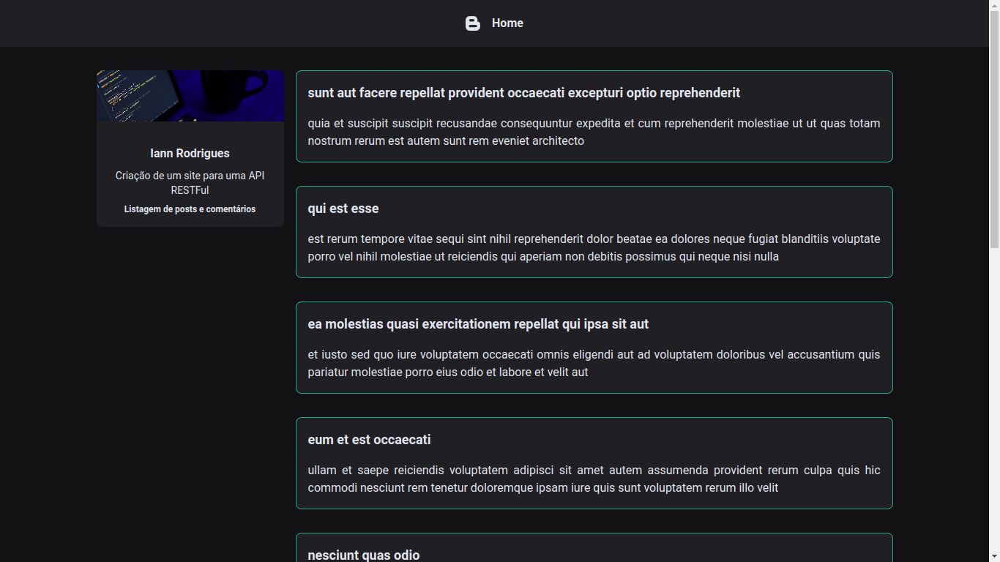
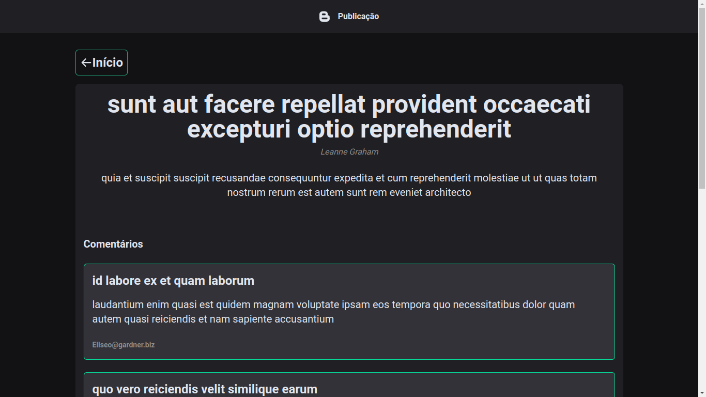
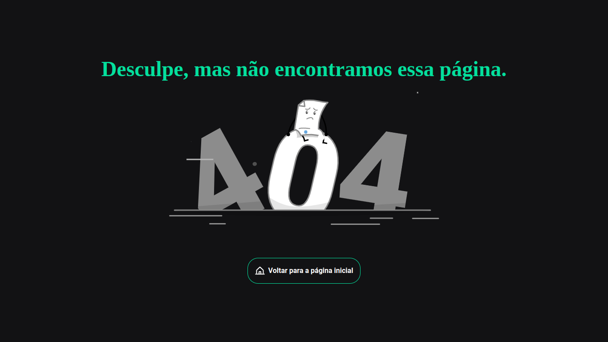

# Desenvolver um front-end para uma API RESTful

## :dart: Objetivo

Desenvolver um front-end para uma API RESTful. A interface deve exibir os posts de um blog, e ao clicar em um post, os comentários associados.

### Serviços disponíveis:
- [x] Listagem de posts;
- [x] Listagem de comentários de um post;
- [x] Listagem de usuários;
- [x] Detalhes de um usuário;


## :book: Estratégia

- 1º Poderia ter feito uma interface exibindo os posts e, ao clicar no post, exibir um Modal com as informações e comentários referente de cada post.

- 2º Desenvolvi 3 páginas (Home, Posts e 404):
  - A Home é a responsável por listar os posts:
    - Lista os 10 primeiros posts e depois posso ir listando mais ao clicar no botão de "Carregar mais posts";
  - A outra página (Posts) ela lista todas as informações do posts que o usuário clicou:
    - Recebe o ID do posts via parâmetros de rota;
    - Busca na API as informações do autor e os comentários do post:
      ```js 
        comentários: api.get(`/posts/${id}/comments`)
        autor: api.get(`/users/${post.userId}`)
      ```
    - Depois que recebe as informações, faz a listagem do: título, conteúdo, autor e comentários do post;
  - A página 404 é para rotas não listadas no site;

## :rocket: Como executar
```bash

# Faça o clone do projeto
git clone https://github.com/Iann-rst/blog.git

# Acessar a pasta
cd blog

# Instalar as dependências
npm install

# Executar o projeto
npm run dev

```

## :camera: Screenshots

<div align="center">
  <h3 align="center">Página Home - Listagem dos posts</h3>
  
</div>

<div align="center">
  <h3 align="center">Página Publicação - Detalhes de um post específico</h3>
  
</div>

<div align="center">
  <h3 align="center">Página Not found - Error de página não encontrada</h3>
  
</div>


